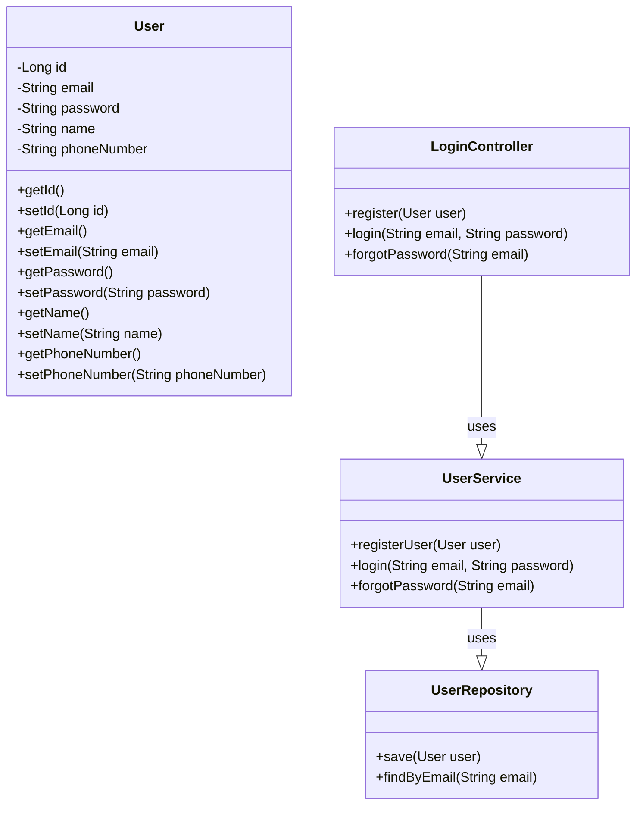

# High-Level Class Diagram

This class diagram captures the high-level structure of the authentication service, including the user entity, service layer, repository layer, and the controller layer.
